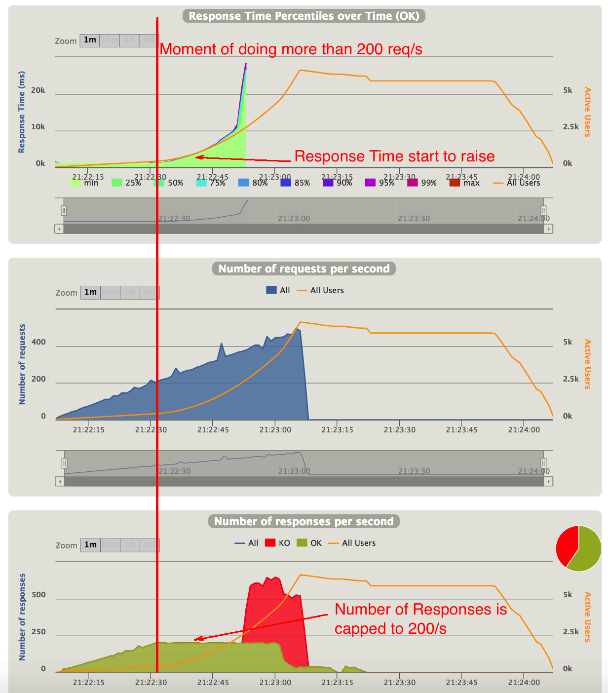
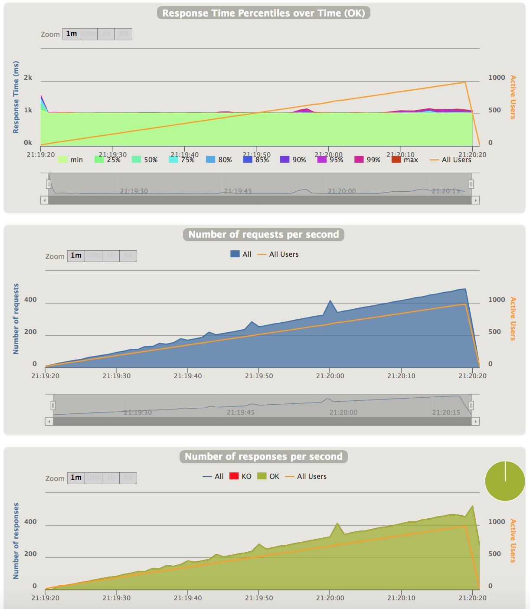

# Blocking vs Reactor Spring benchmarch
This project is a very basic demonstration of performance difference between "traditional" spring-boot app (Tomcat/blocking) and the new reactive spring-boot (Netty/Reactor, introduced in Spring 5 and spring-boot 2).

## Testing Scenario
The comparison focuses only on a very simple scenario of having a REST Controller, which returns some generated data (using [jfairy](https://github.com/Devskiller/jfairy)) and introduces an artificial delay of 1 second to simulate a slow processing. The blocking implementation is implemented in [PesonServletApplication.kt](.person-servlet/src/main/kotlin/cz/zubal/person/PesonServletApplication.kt) and the Reactor based in [PersonReactiveApplication.kt](./person-reactive/src/main/kotlin/cz/zubal/person/PersonReactiveApplication.kt) (inspired by great [blog](https://www.nurkiewicz.com/2018/01/spring-reactor-and-elasticsearch.html) by @nurkiewicz).

The actual load test starts with 10 requests per second and contrinually raises the rate to 500 requests per second over period of 60 seconds. Load test is implemented using [gatling](https://gatling.io/) - the actual load test definition is in [LoadTest.scala](./person-load-test/src/test/scala/cz/zubal/reactor/LoadTest.scala).

## Expected Result

With this scenario, the expectation is that the "traditional" application will soon hit the Tomcat's thread-pool limitation (default thread-pool size is 200), while the reactive application should handle this fine (leveraging Netty's non-blocking http).

## Results
Both load tests issued 15300 requests. The tomcat application was able to handle 9101 of them (6199 timed out after 60s). The reactor application handled all of the requests. There are Gatling reports for both the [tomcat](./results/tomcat-blocking/index.html) and [reactor](./results/netty-reactor/index.html).

### Tomcat
As expected the tomcat application was doing fine until the load reached 200 req./s. After that the response time begun to quickly grow and the requests then started to time out. Especially 'Number of responses per second' shows the tomcat limit of 200 threads handling requests in a blocking way.


### Reactor
As expected the Netty/Reactor handles the load well with it's async/non-blocking processing.


## Running the tests
### Tomcat
Start the app:

```
cd person-servlet
./gradlew bootRun
```
Start the test (in other terminal):

```
./gradlew loadTest
```
Wait for the loadTest to finish (the output contains a path to the Gatling report for the particular run).

### Reactor
Don't forget to stop the tomcat app and repeat the process with person-reactive:

```
cd person-reactive
...
```


